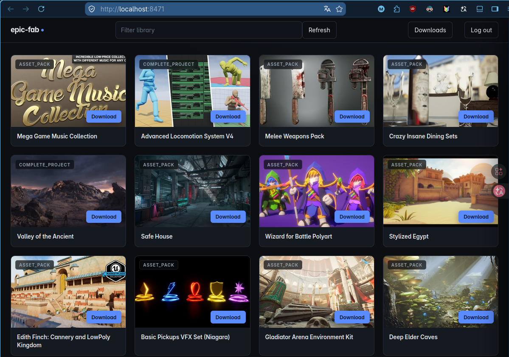
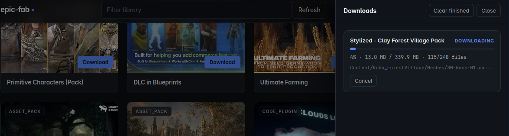

<div align="center">
  

  <h1>Epic-Fab</h1>
  <p><strong>无需 Epic Games Launcher，在 Linux 上管理你的 Fab 资源库。</strong></p>
  <p><a href="./README.en.md">English README</a></p>

  [](./LICENSE)
  [](https://www.typescriptlang.org/)
  [](https://bun.sh/)
  [](https://www.linux.org/)
</div>

---

## ✨ 简介

Epic Games 尚未为 Linux 提供官方 Launcher。`epic-fab` 是一个基于 **Bun + TypeScript** 的 Linux 原生工具，使用浏览器 OAuth 登录你的 Epic 账户，并访问你已拥有的 Fab、Quixel Megascans 和 Unreal Engine Marketplace 资源。

它既可以作为适合脚本和管道处理的命令行工具，也提供本地 Web UI，方便浏览资源库并查看下载进度。

- **浏览**：列出已拥有的 Fab 资源，可输出 JSON。
- **下载**：解析 Epic 清单、并行下载分块并执行 SHA-1 校验。
- **同步**：将资源批量下载到 Unreal Engine 项目的 `Content/Fab/` 目录。
- **本地 UI**：在浏览器中筛选资源、提交下载任务并查看实时进度。
- **无需 Wine / Launcher**：不依赖 Epic Games Launcher 或其 Windows 运行环境。

> [!WARNING]
> 本项目是独立的开源工具，与 Epic Games、Fab 均无隶属、赞助或认可关系。请自行承担使用风险，并遵守 Epic 与 Fab 的相关条款。

---

## 🚀 快速开始

### 环境要求

- Linux
- [Bun](https://bun.sh/) `>= 1.0`

```bash
git clone https://github.com/Me-Maped/epic-fab.git
cd epic-fab
bun install

# 可选：安装为全局命令
bun link
```

### 登录并查看资源库

```bash
# 浏览器会打开 Epic 登录页；完成登录后，将授权码粘贴回终端
epic-fab auth

# 查看当前登录账户
epic-fab whoami

# 列出已拥有的资源
epic-fab list

# 以 JSON 输出，方便 jq 等工具处理
epic-fab list --json | jq .
```

令牌保存在 `~/.config/epic-fab/auth.json`，文件权限会限制为仅当前用户可读写；令牌不会出现在 URL 或日志中。

---

## 🖥️ 本地 Web UI

除了 CLI，项目还包含一个零构建步骤的本地单页界面。它由 `src/ui/` 中的原生 HTML、CSS 和 JavaScript 实现，并由 CLI 提供本地 API；不会把你的资源库数据发送到第三方服务。

启动 UI：

```bash
# 默认监听 http://localhost:8471，并尝试打开浏览器
epic-fab ui

# 指定端口，且不自动打开浏览器
epic-fab ui --port 9000 --no-open
```

UI 包含以下功能：

| 功能 | 说明 |
| --- | --- |
| Epic 登录 | 打开官方登录页，并在本地界面粘贴授权码完成认证。 |
| 资源库浏览 | 以卡片形式展示已拥有的资源，支持按标题即时筛选和手动刷新。 |
| 下载任务 | 从资源卡片创建下载任务；下载抽屉展示队列、进度、成功或失败状态。 |
| 实时反馈 | 使用服务端事件（SSE）更新下载进度；通知消息提示错误与操作结果。 |
| 本地优先 | UI 仅监听本机地址，并复用 CLI 的认证、资源库与下载模块。 |

### UI 截图


| 界面 | 截图位置 | 说明 |
| --- | --- | --- |
| 资源库 | `docs/assets/screenshots/library.png` | 展示搜索、资源卡片和下载入口；请注意打码账户名与私有资源信息。 |
| 下载面板 | `docs/assets/screenshots/downloads.png` | 展示下载队列及实时进度。 |

<!-- 截图放入上述路径后，取消下面各图片行的注释。 -->
<!--  -->
<!--  -->

---

## 📦 命令参考

| 命令 | 说明 |
| --- | --- |
| `epic-fab auth` | 通过浏览器 OAuth 登录 Epic 账户，并粘贴授权码。 |
| `epic-fab whoami` | 显示当前认证账户的显示名称与账户 ID。 |
| `epic-fab list [--json]` | 列出已拥有的 Fab 资源。 |
| `epic-fab download <asset-id> --into <目录>` | 下载一个资源到指定目录。 |
| `epic-fab sync --project <路径>` | 批量同步资源库到 UE 项目的 `Content/Fab/`。 |
| `epic-fab ui [--port <端口>] [--no-open]` | 启动本地 Web UI，默认端口为 `8471`。 |
| `epic-fab logout` | 删除本地保存的认证令牌。 |

常用选项：

```text
--into <dir>          download 的目标目录（默认：当前目录）
--project <path>      sync 的 Unreal Engine 项目根目录
--concurrency <n>     CDN 分块并发数（默认：8）
--no-skip             即使本地 SHA-1 匹配也重新下载
--refresh             跳过本地资源库缓存并强制刷新
```

程序退出码：`0` 成功、`1` 用户输入或参数错误、`2` 尚未认证、`3` 网络错误。

---

## 🔧 工作原理

```text
浏览器 OAuth 登录
       │
       ▼
Epic 账户服务 ── 访问令牌 ──► Fab 资源库 API
                                      │
                                      ▼
                             资源清单与 CDN 签名 URL
                                      │
                                      ▼
                        并行分块下载、解压与 SHA-1 校验
                                      │
                                      ▼
                       目标目录 / UE Content/Fab/ 目录
```

下载器支持 Epic 的二进制与 JSON 清单格式，按需获取 CDN 分块并组装文件。对于同步任务，资源会写入指定项目的 `Content/Fab/` 树中。

---

## 🛠️ 开发

```bash
# 类型检查
bun run typecheck

# 直接运行 CLI
bun run src/cli.ts --help
```

项目结构：

```text
src/
├── cli.ts             # CLI 参数解析与命令分发
├── auth.ts            # Epic OAuth 与令牌存储
├── api.ts             # Fab 资源库 API
├── download.ts        # 分块下载与文件组装
├── manifestParser.ts  # Epic 清单解析
├── serve.ts           # 本地 UI 服务器与 JSON/SSE API
└── ui/                # 原生 HTML / CSS / JavaScript 界面
```

欢迎提交 Issue 和 PR。提交前请至少运行 `bun run typecheck`，并避免提交认证令牌、下载资源或任何私有账户信息。

---

## 🙏 致谢

- [Legendary](https://github.com/derrod/legendary)：Epic OAuth 与清单格式的重要参考。
- [egs-api-rs](https://github.com/AchetaGames/egs-api-rs)：Fab API 集成参考。

## 📜 许可证

[MIT](./LICENSE) © 2026 Starks Labs
